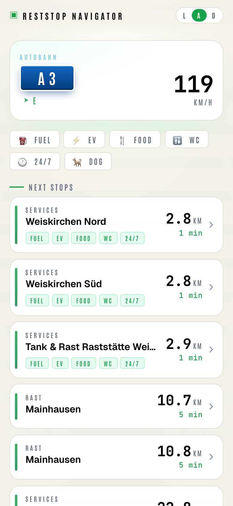
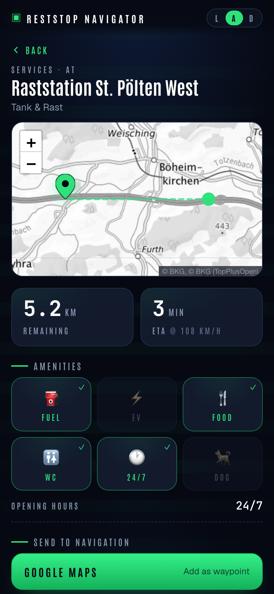

# Reststop Navigator

[](https://github.com/tamcore/reststop-navigator/actions/workflows/test.yaml) [](https://github.com/tamcore/reststop-navigator/actions/workflows/e2e.yaml) [](https://github.com/tamcore/reststop-navigator/blob/master/go.mod)

A PWA that, given your live GPS, identifies which highway and direction you're driving and lists the upcoming rest stops — filterable by fuel, EV charging, food, toilets, 24/7 opening, and dog-friendliness.

When you've picked one, the detail page hands off to Google Maps, Apple Maps, or Waze with the rest stop as a destination.

No GPS? Click **Demo mode** in the footer to explore the app with a fixed A3 Frankfurt → Hanau fixture — same as the screenshots above.

<p align="center">
  
  &nbsp;
  
</p>

## Coverage

MVP supports motorways and trunk roads in:

- Germany
- Austria
- Slovakia
- Czechia

## Architecture

- **Backend:** Go (chi router), Redis cache.
- **Frontend:** SvelteKit PWA, embedded into the Go binary.
- **Data:** Rest-stop data from OpenStreetMap via the Overpass API. Cached lazily into Redis as 0.5° geographic tiles on first request, with a 7-day TTL.
- **Map tiles:** BKG TopPlusOpen © Bundesamt für Kartographie und Geodäsie (dl-de/by-2.0) — EU-hosted, no API key.
- **Deploy:** Helm chart + Kubernetes (`ingress-nginx` + cert-manager), released via goreleaser.

No accounts. No tracking. The browser asks for geolocation; the backend stores no identifying data. With the optional admin backend enabled, the last reported position per anonymous browser-generated UUID is kept in Redis for 15 minutes (live view only, nothing persisted).

## Admin backend (optional)

A single-user admin live view at `/admin` shows active clients on a map, the Redis tile cache (tiles + contained stops), and runtime stats. Disabled unless `RESTSTOP_ADMIN_PASSWORD` is set (HTTP Basic Auth, any username). Via Helm:

```sh
helm upgrade ... --set admin.enabled=true --set admin.password=<secret>
```

The chart stores the password in a Kubernetes Secret and injects it as `RESTSTOP_ADMIN_PASSWORD`; `admin.existingSecret` lets you bring your own Secret.

## Docs

Engineering docs live under [`docs/`](docs/):

- [architecture.md](docs/architecture.md) — system overview, request flow, design decisions.
- [development.md](docs/development.md) — clone, build, test, replay.
- [deployment.md](docs/deployment.md) — release pipeline, GitOps notes, dev deploys.

Workflow rules for AI coding agents are in [AGENTS.md](AGENTS.md).

## Status

Pre-MVP.
